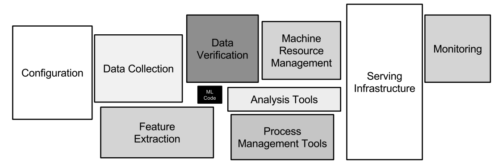

# mlops

#  References

* [Airflow](#Airflow)
* [kubeflow](#kubeflow)
* [Data](#Data)
* [Architecture](#Architecture)


# Airflow
<span style="color: teal">&#x1F535; Airflow
</span>

### EFK > Airflow

> https://medium.com/@dulshanr12/airflow-log-integration-with-fluent-bit-elk-stack-kubernetes-f2afa3a6ff00

* cron for DAGs
* monitoring/archistrator 
* ETL pipelines (DAGs)
* can get data from Elasticsearch/mysql
* Created git-sync for remote DAGS
* Logs to EKF

EFK:de1:fbomal

```
kubectl create ns dataplatform

helm repo add elastic https://helm.elastic.co
helm repo add apache-airflow https://airflow.apache.org
helm repo add fluent https://fluent.github.io/helm-charts
helm repo update

helm install elastic-operator-crds elastic/eck-operator-crds --version 2.6.1
helm install elastic-operator elastic/eck-operator --version 2.6.1 -n elastic-system --create-namespace \
  --set=installCRDs=false \
  --set=managedNamespaces='{dataplatform}' \
  --set=createClusterScopedResources=false \
  --set=webhook.enabled=false \
  --set=config.validateStorageClass=false

kubectl -n elastic-system apply -f - <<EOF
kind: Secret
apiVersion: v1
metadata:
  name: de-filerealm-secret
  namespace: elastic-system
stringData:
  users: |-
    de1:$2a$10$xfkUJWUfFQpnh6crf05NiuT1FoCSPiOKyAGvU.lORHusHV7XhScZG
  users_roles: |-
    superuser:de1
---
apiVersion: elasticsearch.k8s.elastic.co/v1
kind: Elasticsearch
metadata:
  name: quickstart
spec:
  version: 8.5.0
  auth:
    fileRealm:
    - secretName: de-filerealm-secret
  nodeSets:
  - name: default
    count: 1
    config:
      action.auto_create_index:  "+filebeat-*,+fluentbit-*,-index1,+ind*" 
      node.store.allow_mmap: false
EOF

kubectl get elasticsearch -n elastic-system
helm install -f airflow/airflow-values.yaml airflow-uat apache-airflow/airflow --version 1.7.0 --namespace dataplatform
kubectl apply -f airflow/kibana-values.yaml -n elastic-system
kubectl -n elastic-system apply -f airflow/logstash.yam l
helm install -f airflow/fluent-bit-values.yaml fluent-bit fluent/fluent-bit --version 0.22.0 --namespace elastic-system

kubectl port-forward svc/airflow-uat-webserver 8080:8080 --namespace dataplatform
kubectl port-forward service/quickstart-kb-http 5601:5601 -n elastic-system
kubectl -n elastic-user get secret quickstart-es-elastic-user -o go-template='{{.data.elastic | base64decode}}'
```

### docker-compose

https://airflow.apache.org/docs/apache-airflow/stable/start/docker.html#docker-compose-yaml

```commandline
C:\Users\<USER>\docker\airflow\
curl -LfO 'https://airflow.apache.org/docs/apache-airflow/2.3.2/docker-compose.yaml'
docker-compose up airflow-init
docker-compose up
localhost:8080, login with user “airflow” and password “airflow”
```

* PUT DAGS into: C:\Users\<USER>\docker\airflow\dags


# kubeflow
<span style="color: teal">&#x1F535; kubeflow
</span>

https://www.kubeflow.org/docs/components/pipelines/installation/localcluster-deployment/


### KIND

```
choco install kind -y
kind create cluster
```

Kubeflow:

```
export PIPELINE_VERSION=1.8.2
kubectl apply -k "github.com/kubeflow/pipelines/manifests/kustomize/cluster-scoped-resources?ref=$PIPELINE_VERSION"
kubectl wait --for condition=established --timeout=60s crd/applications.app.k8s.io
kubectl apply -k "github.com/kubeflow/pipelines/manifests/kustomize/env/platform-agnostic-pns?ref=$PIPELINE_VERSION"

kubectl port-forward -n kubeflow svc/ml-pipeline-ui 8080:80

```

### Compile python onto YAML using conda create new python environment 

Install  miniconda
> https://docs.conda.io/en/latest/miniconda.html

```
conda create --name mlops-pipeline python=3.7
conda init bash
exit
conda activate mlops-pipeline
cd mlops/kubeflow/containerless
pip3 install kfp --upgrade
dsl-compile --py containerless.py --out pipeline.yaml
```

```
conda create --name metrics-pipeline python=3.7
conda init bash
exit
conda activate metrics-pipeline
cd mlops/kubeflow/containerless
pip3 install kfp --upgrade
dsl-compile --py containerless.py --out pipeline.yaml
```


# Data
<span style="color: teal">&#x1F535; Data
</span>

* https://web.stanford.edu/class/archive/cs/cs109/cs109.1166/stuff/titanic.csv"

# Architecture
<span style="color: teal">&#x1F535; Architecture
</span>

### Pipelines-architecture

* advanced_pipeline: https://pytorch.org/torchx/latest/examples_pipelines/kfp/advanced_pipeline.html
* Download https://gist.githubusercontent.com/Anvil-Late/819bd6433c1c2987a263f097027ec1a2/raw/8f93a2de4e69dd36306231e3b924bb920c931e11/full_pipeline.py
* The best practises: https://github.com/kelvins/awesome-mlops





Pipeline: Triger >  scan > download > unzip > старт разных эксперементов > get output > send output > monitor > оценка качества > метрики после эксперемента скорость/качество
