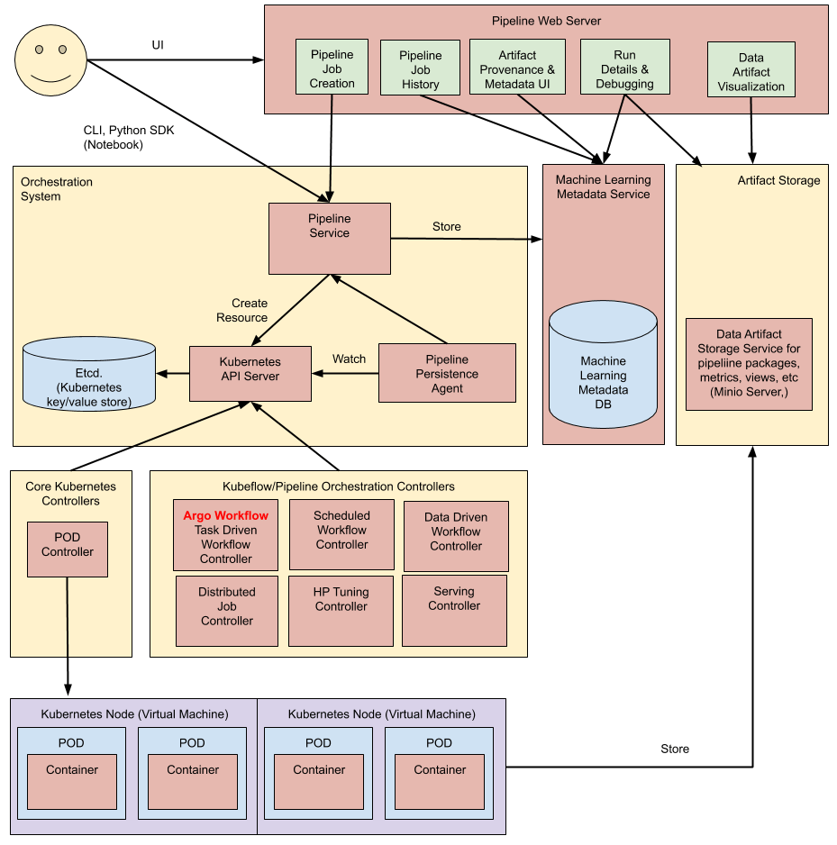

# mlops

#  References

* [Airflow](#Airflow)
* [kubeflow](#kubeflow)
* [Data](#Data)
* [Architecture](#Architecture)


# Airflow
<span style="color: teal">&#x1F535; Airflow
</span>

https://airflow.apache.org/docs/apache-airflow/stable/start/docker.html#docker-compose-yaml

```commandline
C:\Users\<USER>\docker\airflow\
curl -LfO 'https://airflow.apache.org/docs/apache-airflow/2.3.2/docker-compose.yaml'
docker-compose up airflow-init
docker-compose up
localhost:8080, login with user “airflow” and password “airflow”
```

* PUT DAGS into: C:\Users\<USER>\docker\airflow\dags


# kubeflow
<span style="color: teal">&#x1F535; kubeflow
</span>

https://www.kubeflow.org/docs/components/pipelines/installation/localcluster-deployment/


### KIND

```
choco install kind -y
kind create cluster
```

Kubeflow:

```
export PIPELINE_VERSION=1.8.2
kubectl apply -k "github.com/kubeflow/pipelines/manifests/kustomize/cluster-scoped-resources?ref=$PIPELINE_VERSION"
kubectl wait --for condition=established --timeout=60s crd/applications.app.k8s.io
kubectl apply -k "github.com/kubeflow/pipelines/manifests/kustomize/env/platform-agnostic-pns?ref=$PIPELINE_VERSION"

kubectl port-forward -n kubeflow svc/ml-pipeline-ui 8080:80

```

### Compile python onto YAML using conda create new python environment 

Install  miniconda
> https://docs.conda.io/en/latest/miniconda.html

```
conda create --name mlops-pipeline python=3.7
conda init bash
exit
conda activate mlops-pipeline
cd mlops/kubeflow/containerless
pip3 install kfp --upgrade
dsl-compile --py containerless.py --out pipeline.yaml
```

```
conda create --name metrics-pipeline python=3.7
conda init bash
exit
conda activate metrics-pipeline
cd mlops/kubeflow/containerless
pip3 install kfp --upgrade
dsl-compile --py containerless.py --out pipeline.yaml
```


# Data
<span style="color: teal">&#x1F535; Data
</span>

* https://web.stanford.edu/class/archive/cs/cs109/cs109.1166/stuff/titanic.csv"

# Architecture
<span style="color: teal">&#x1F535; Architecture
</span>

### Pipelines-architecture

* advanced_pipeline: https://pytorch.org/torchx/latest/examples_pipelines/kfp/advanced_pipeline.html
* Download https://towardsdatascience.com/tutorial-basic-kubeflow-pipeline-from-scratch-5f0350dc1905



